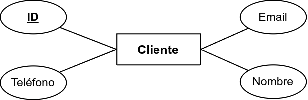
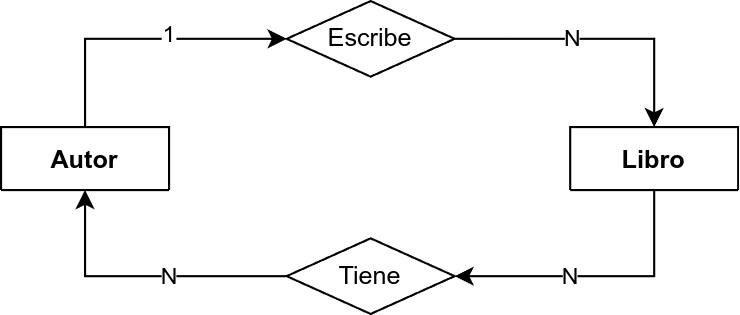

# Introducción al Modelo E-R

## ¿Por qué modelamos los datos?
- Un diseño deficiente de base de datos genera redundancia, inconsistencia y problemas de mantenimiento.
- Necesitamos una forma estructurada para representar los datos antes de implementarlos en un sistema.
- El **Modelo Entidad-Relación (E-R)** es una técnica gráfica que nos permite diseñar bases de datos correctamente.

---

# ¿Qué es el Modelo Entidad-Relación?
- Es una técnica para representar datos y sus relaciones en un sistema.
- Se usa antes de la implementación en bases de datos relacionales.
- Permite visualizar cómo interactúan las entidades antes de definir estructuras en SQL.

**Ejemplo:**  
Un sistema de biblioteca debe manejar información de libros, usuarios y préstamos.  
- ¿Cómo se relacionan los usuarios con los libros?
- ¿Cómo aseguramos que cada préstamo esté correctamente registrado?

---

# Elementos del Modelo E-R

## Entidades y Atributos
- **Entidad:** Representa un objeto del mundo real con información relevante.
- **Atributos:** Características o propiedades de una entidad.

---

# Elementos del Modelo E-R

## Ejemplo

Entidad **Cliente**  
- Atributos: *ID, Nombre, Email, Teléfono*

{width=50%}

---

# Elementos del Modelo E-R

## Relaciones
- **Definen cómo interactúan las entidades entre sí.**
- Se representan con un **rombo** en los diagramas E-R.

---

# Elementos del Modelo E-R

## Ejemplo

- **Cliente realiza Pedido**  
  - Cliente (Entidad)
  - Pedido (Entidad)
  - Relación: "realiza"

{width=50%}

---

# Elementos del Modelo E-R

## Cardinalidad
- **1:1 (Uno a Uno):** Un país tiene una única capital.
- **1:N (Uno a Muchos):** Un cliente puede hacer varios pedidos.
- **N:N (Muchos a Muchos):** Un estudiante puede inscribirse en varios cursos, y un curso tiene varios estudiantes.

---

# Elementos del Modelo E-R

## Ejemplo

- Un **autor** puede escribir **muchos libros** (1:N).  
- Un **libro** puede tener **varios autores** (N:N).  

{width=50%}

---

# Diagramas Entidad-Relación

## Representación gráfica
- **Entidades** → Rectángulos  
- **Relaciones** → Rombos  
- **Atributos** → Óvalos  
- **Llaves primarias** → Subrayadas  

---

# Construcción de un Diagrama E-R

## Paso a paso:
1. Identificar **entidades** y sus atributos.
2. Definir **relaciones** entre las entidades.
3. Determinar la **cardinalidad** de las relaciones.
4. Dibujar el **diagrama** con los símbolos correctos.

**Ejemplo:**  
Para una tienda en línea:
- Entidades: Cliente, Pedido, Producto.
- Relaciones: Cliente *realiza* Pedido, Pedido *contiene* Producto.
- Cardinalidad: Un cliente puede hacer muchos pedidos, un pedido puede contener varios productos.

---

# De E-R a una Base de Datos Relacional

## Conversión a tablas
- **Cada entidad → Tabla** con atributos como columnas.
- **Relaciones 1:N → Llave foránea** en la tabla del lado "muchos".
- **Relaciones N:N → Tabla intermedia** con llaves foráneas.

**Ejemplo:**  
- Entidad Cliente → **Tabla Cliente (id, nombre, email)**
- Entidad Pedido → **Tabla Pedido (id, fecha, cliente_id)**
- Relación Cliente-Pedido → **Llave foránea cliente_id en Pedido**

---

# Resumen y Próximos Pasos

## Lo aprendido hoy:
[x] ¿Qué es el modelo E-R y para qué se usa?  
[x] ¿Cuáles son sus elementos principales?  
[x] ¿Cómo representamos un diagrama E-R?  
[x] ¿Cómo se convierte en una base de datos relacional?  

## Próxima clase:
- **Reglas de normalización** para mejorar la estructura de las bases de datos.

---

# Preguntas y Discusión
¿Tienes dudas? ¡Hablemos!
