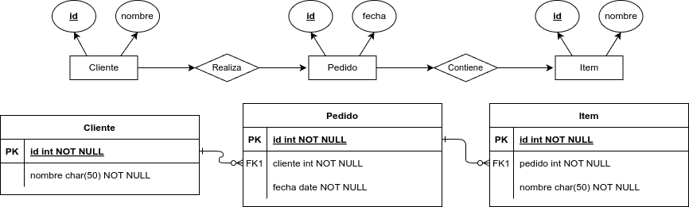

# Introducción al Modelo Relacional

El modelo relacional es el estándar más utilizado para la gestión de bases de
datos, basado en la **lógica de predicados** y la **teoría de conjuntos**.
Propuesto en 1970 por Edgar F. Codd (IBM), revolucionó la manera de estructurar
y gestionar datos.

---

# Principios Claves

- Organiza los datos en tablas (relaciones), donde cada fila representa un
registro (tupla) y cada columna un campo (atributo).

- Facilita la representación lógica de la información, permitiendo un modelado
claro y escalable.

- A partir de un esquema de base de datos, se define su implementación en un
DBMS (Database Management System).

- Este modelo sigue siendo el pilar fundamental en la administración de datos
dinámicos y la resolución de problemas del mundo real.

---

# Principales Conceptos

## El Modelo Relacional se ocupa de:

- La estructura de datos
- La manipulación de datos
- La integridad de los datos

## Donde las relaciones están formadas por:

- Atributos (columnas)
- Tuplas (conjunto de filas)

---

# Procedimiento de Diseño

Existen dos formas para la construcción de modelos relacionales:

1. Convertir el modelo entidad relación (ER) en tablas, con una depuración
   lógica y la aplicación de restricciones de integridad,
1. O, Creando un conjunto de tablas iniciales y aplicando operaciones de
   normalización hasta conseguir el esquema más óptimo.

{width=70%}

---

# Objetivos del Modelo Relacional

- **Independencia Física**: La forma de almacenar los datos no debe influir en su
manipulación. Si el almacenamiento físico cambia, los usuarios que acceden a
esos datos no tienen que modificar sus aplicaciones.

- **Independencia Lógica**: Las aplicaciones que utilizan la base de datos no deben
ser modificadas por que se inserten, actualicen y eliminen datos.

- **Flexibilidad**: En el sentido de poder presentar a cada usuario los datos de la
forma en que éste prefiera

- **Uniformidad**: Las estructuras lógicas de los datos siempre tienen una única
forma conceptual (las tablas), lo que facilita la creación y manipulación de la
base de datos por parte de los usuarios.

- **Sencilles**: Las características anteriores hacen que este Modelo sea fácil de
comprender y de utilizar por parte del usuario final.

---

# Reglas y Características

- Los datos son atómicos.
- Los datos de cualquier columna son de un solo tipo.
- Cada columna posee un nombre único dentro de la tabla.
- El orden de las columnas no es de importancia para la tabla.
- Las columnas de una relación se conocen como atributos.
- Cada atributo tiene un dominio,
- No existen 2 filas en la tabla que sean idénticas.
- La información en las bases de datos son representados como datos explícitos.
- Cada relación tiene un nombre específico y diferente al resto de las
relaciones.

---

# Reglas y Características
- Los valores de los atributos son atómicos: en cada tupla, cada atributo
(columna) toma un solo valor. Se dice que las relaciones están normalizadas.
- El orden de los atributos no importa: los atributos no están ordenados.
- Cada tupla es distinta de las demás: no hay tuplas duplicadas
- El orden de las tuplas no importa: las tuplas no están ordenadas.
- Los atributos son atómicos: en cada tupla, cada atributo (columna) toma un
solo valor. Se dice que las relaciones están normalizadas.

---

# Definiciones

- **Relación**: Tabla bidimensional para la representación de datos. Ejemplo:
Estudiantes.
- **Esquemas**: Forma de representar una relación y su conjunto de atributos.
Ejemplo: Estudiantes (id estudiante, nombre(s), apellido(s), edad, género)
- **Tuplas**: Filas de una relación que contiene valores para cada uno de los
atributos (equivale a los registros). Ejemplo: 34563, José, Martinez, 19,
Masculino. Representa un objeto único de datos implícitamente estructurados en
una tabla. Un registro es un conjunto de campos que contienen los datos que
pertenecen a una misma entidad.

---

# Definiciones

- **Atributos**: Columnas de una relación y describe las características
particulares de cada campo. Ejemplo: id estudiante
- **Claves**: Campo cuyo valor es único para cada registro. Principal,
identifica una tabla, y Foránea, clave principal de otra tabla relacionada.
Ejemplo: id estudiante.
- **Cardinalidad**: número de tuplas(m).
- **Grado**: número de atributos(n).
- **Dominio**: colección de valores de los cuales el atributo obtiene su
atributo.

---

# Definiciones

\begin{table}[h!]
\centering
\begin{tabular}{|c|c|c|}
\hline
\textbf{Modelo Relacional} & \textbf{Tablas} & \textbf{Archivos} \\
\hline
Relación & Tabla & Archivo \\
Tupla & Fila & Registro \\
Atributo & Columna & Campo \\
Grado & Número de columnas & Número de campos \\
Cardinalidad & Número de filas & Número de registros \\
\hline
\end{tabular}
\end{table}

---

# Ejemplo

---

# Preguntas y Discusión
¿Tienes dudas? ¡Hablemos!
