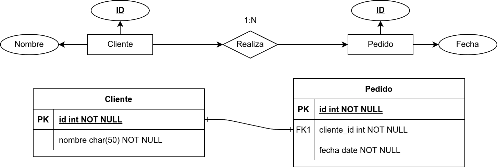
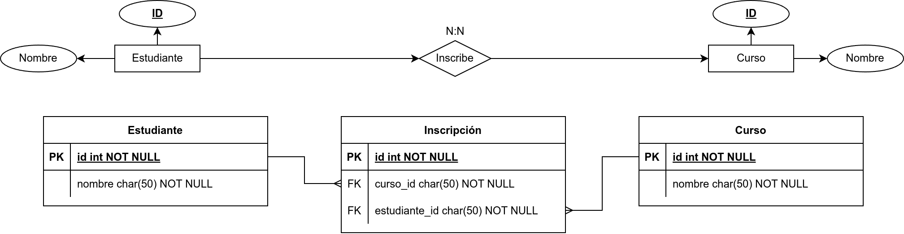

# Reglas de Cardinalidad en el Modelo Relacional

## ¿Por qué es importante?
- La **cardinalidad** en el Modelo Entidad-Relación (MER) define cómo se asocian las entidades.
- En el **Modelo Relacional (MR)**, estas asociaciones se traducen en **claves foráneas** y, en algunos casos, en **tablas intermedias**.
- Una conversión adecuada garantiza la **integridad referencial** y evita **anomalías en los datos**.

---

# Cardinalidad 1:1 (Uno a Uno)

- Cada entidad en la relación se asocia con **máximo una** entidad del otro lado.
- Se implementa con una **clave foránea** en una de las tablas.
- Si la relación es obligatoria en ambos sentidos, puede **fusionarse en una sola tabla**.

**Ejemplo: Persona y Pasaporte (1:1)**

\begin{center}
\includegraphics[width=0.75\textwidth]{imgs/1to1.png}
\end{center}

---

# Cardinalidad 1:1 (Uno a Uno)

**Conversión a Tablas**
```sql
CREATE TABLE persona (
    id INT PRIMARY KEY,
    nombre VARCHAR(100)
);

CREATE TABLE pasaporte (
    id INT PRIMARY KEY,
    numero VARCHAR(20),
    persona_id INT UNIQUE,
    FOREIGN KEY (persona_id) REFERENCES persona(id)
);
```

---

# Cardinalidad 1:1 — Ejemplo con Datos

:::::: {.columns}
::: {.column width="45%"}
| id | nombre    |
|----|-----------|
| 1  | Ana López |
| 2  | Carlos R. |
| 3  | María T.  |

Table: **persona**
:::
::: {.column width="55%"}
| id | numero     | persona_id |
|----|------------|------------|
| 1  | AB-123456  | 1          |
| 2  | CD-789012  | 2          |
| 3  | EF-345678  | 3          |

Table: **pasaporte**
:::
::::::

```{=latex}
\vspace{1em}
```

> 6 filas en 2 tablas para 3 relaciones. Crecimiento **lineal**.

---

# Cardinalidad 1:N (Uno a Muchos)

- Una entidad del lado **1** se asocia con **varias** del lado **N**.
- La clave foránea se coloca en la tabla del lado **N**.

**Ejemplo: Cliente y Pedido (1:N)**


---

# Cardinalidad 1:N (Uno a Muchos)

**Conversión a Tablas**
```sql
CREATE TABLE cliente (
    id INT PRIMARY KEY,
    nombre VARCHAR(100)
);

CREATE TABLE pedido (
    id INT PRIMARY KEY,
    fecha DATE,
    cliente_id INT,
    FOREIGN KEY (cliente_id) REFERENCES cliente(id)
);
```

---

# Cardinalidad 1:N — Ejemplo con Datos

:::::: {.columns}
::: {.column width="35%"}
| id | nombre    |
|----|-----------|
| 1  | Ana López |
| 2  | Carlos R. |

Table: **cliente**
:::
::: {.column width="65%"}
| id | fecha      | cliente_id |
|----|------------|------------|
| 1  | 2025-03-01 | 1          |
| 2  | 2025-03-05 | 1          |
| 3  | 2025-03-10 | 1          |
| 4  | 2025-03-12 | 2          |

Table: **pedido**
:::
::::::

```{=latex}
\vspace{1em}
```

> 6 filas en 2 tablas. La FK se repite pero no genera tablas extra — crecimiento **lineal**.

---

# Cardinalidad N:N (Muchos a Muchos)

- Se usa una **tabla intermedia** con **claves foráneas** de ambas entidades.
- La tabla intermedia puede incluir **atributos adicionales** si la relación tiene información relevante.

**Ejemplo: Estudiantes y Cursos (N:N)**


---

# Cardinalidad N:N (Muchos a Muchos)

**Conversión a Tablas**
```sql
CREATE TABLE estudiante (
    id INT PRIMARY KEY,
    nombre VARCHAR(100)
);

CREATE TABLE curso (
    id INT PRIMARY KEY,
    nombre VARCHAR(100)
);
```

---

# Cardinalidad N:N (Muchos a Muchos)

**Conversión a Tablas (continuación)**
```sql
CREATE TABLE inscripcion (
    estudiante_id INT,
    curso_id INT,
    PRIMARY KEY (estudiante_id, curso_id),
    FOREIGN KEY (estudiante_id) REFERENCES estudiante(id),
    FOREIGN KEY (curso_id) REFERENCES curso(id)
);
```

---

# Cardinalidad N:N — Ejemplo con Datos

:::::: {.columns}
::: {.column width="45%"}
| id | nombre    |
|----|-----------|
| 1  | Ana López |
| 2  | Carlos R. |
| 3  | María T.  |

Table: **estudiante**
:::
::: {.column width="55%"}
| id | nombre          |
|----|-----------------|
| 1  | Base de Datos   |
| 2  | Programación    |
| 3  | Redes           |

Table: **curso**
:::
::::::

---

# Cardinalidad N:N — Tabla Intermedia

| estudiante_id | curso_id |
|---------------|----------|
| 1             | 1        |
| 1             | 2        |
| 2             | 1        |
| 2             | 3        |
| 3             | 2        |

Table: **inscripcion** (5 filas)

```{=latex}
\vspace{1em}
```

> **Almacenamiento:** 11 filas en 3 tablas para 5 relaciones. La tabla intermedia puede crecer hasta **N × M** filas (3 × 3 = 9 posibles). Crecimiento **multiplicativo**.

---

# N:N — ¿Qué pasa sin tabla intermedia?

Si intentamos guardar todo en una sola tabla:

| estudiante_id | estudiante | curso_id | curso         |
|---------------|------------|----------|---------------|
| 1             | Ana López  | 1        | Base de Datos |
| 1             | Ana López  | 2        | Programación  |
| 2             | Carlos R.  | 1        | Base de Datos |
| 2             | Carlos R.  | 3        | Redes         |
| 3             | María T.   | 2        | Programación  |

Table: **Sin tabla intermedia** (5 filas)

- Nombres **duplicados** — actualizar uno requiere modificar múltiples filas.
- 1.000 estudiantes × 100 cursos = hasta **100.000 filas** redundantes.

---

# N:N — Comparación de almacenamiento

| Enfoque | Tablas | Filas | Datos duplicados |
|:--------|:------:|:-----:|:----------------:|
| Sin intermedia | 1 | 5 | Sí, en cada fila |
| Con intermedia | 3 | 11 | No               |

```{=latex}
\vspace{1em}
```

- Sin intermedia: más filas con datos repetidos → más **memoria**, **anomalías de actualización**.
- Con intermedia: más tablas pero cada dato se guarda **una sola vez**.
- El costo del JOIN se compensa con **integridad** y **ahorro de espacio**.

---

# Resumen y Próximos Pasos

## Hoy aprendimos:
[x] Cómo convertir relaciones 1:1, 1:N y N:N en el Modelo Relacional.  
[x] Cómo usar claves foráneas y tablas intermedias.  

## Próxima clase:
- **Reglas de normalización** para mejorar el diseño de bases de datos.

---

# Preguntas y Discusión
¿Tienes dudas? ¡Hablemos!
