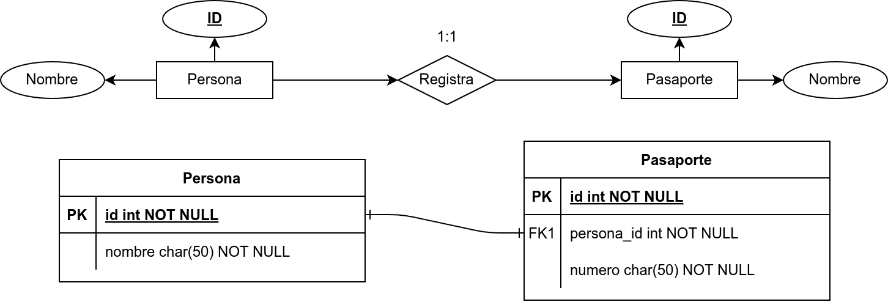

# Reglas de Cardinalidad en el Modelo Relacional

## ¿Por qué es importante?
- La **cardinalidad** en el Modelo Entidad-Relación (MER) define cómo se asocian las entidades.
- En el **Modelo Relacional (MR)**, estas asociaciones se traducen en **claves foráneas** y, en algunos casos, en **tablas intermedias**.
- Una conversión adecuada garantiza la **integridad referencial** y evita **anomalías en los datos**.

---

# Cardinalidad 1:1 (Uno a Uno)

- Cada entidad en la relación se asocia con **máximo una** entidad del otro lado.
- Se implementa con una **clave foránea** en una de las tablas.
- Si la relación es obligatoria en ambos sentidos, puede **fusionarse en una sola tabla**.

**Ejemplo: Persona y Pasaporte (1:1)**  


---

# Cardinalidad 1:1 (Uno a Uno)

**Conversión a Tablas**
```sql
CREATE TABLE Persona (
    ID INT PRIMARY KEY,
    Nombre VARCHAR(100)
);

CREATE TABLE Pasaporte (
    ID INT PRIMARY KEY,
    Numero VARCHAR(20),
    Persona_ID INT UNIQUE,
    FOREIGN KEY (Persona_ID) REFERENCES Persona(ID)
);
```

---

# Cardinalidad 1:N (Uno a Muchos)

- Una entidad del lado **1** se asocia con **varias** del lado **N**.
- La clave foránea se coloca en la tabla del lado **N**.

**Ejemplo: Cliente y Pedido (1:N)**


---

# Cardinalidad 1:N (Uno a Muchos)

**Conversión a Tablas**
```sql
CREATE TABLE Cliente (
    ID INT PRIMARY KEY,
    Nombre VARCHAR(100)
);

CREATE TABLE Pedido (
    ID INT PRIMARY KEY,
    Fecha DATE,
    Cliente_ID INT,
    FOREIGN KEY (Cliente_ID) REFERENCES Cliente(ID)
);
```

---

# Cardinalidad N:N (Muchos a Muchos)

- Se usa una **tabla intermedia** con **claves foráneas** de ambas entidades.
- La tabla intermedia puede incluir **atributos adicionales** si la relación tiene información relevante.

**Ejemplo: Estudiantes y Cursos (N:N)**


---

# Cardinalidad N:N (Muchos a Muchos)

**Conversión a Tablas**
```sql
CREATE TABLE Estudiante (
    ID INT PRIMARY KEY,
    Nombre VARCHAR(100)
);

CREATE TABLE Curso (
    ID INT PRIMARY KEY,
    Nombre VARCHAR(100)
);
```

---

# Cardinalidad N:N (Muchos a Muchos)

**Conversión a Tablas (continuación)**
```sql
CREATE TABLE Inscripcion (
    Estudiante_ID INT,
    Curso_ID INT,
    PRIMARY KEY (Estudiante_ID, Curso_ID),
    FOREIGN KEY (Estudiante_ID) REFERENCES Estudiante(ID),
    FOREIGN KEY (Curso_ID) REFERENCES Curso(ID)
);
```

---

# Resumen y Próximos Pasos

## Hoy aprendimos:
[x] Cómo convertir relaciones 1:1, 1:N y N:N en el Modelo Relacional.  
[x] Cómo usar claves foráneas y tablas intermedias.  

## Próxima clase:
- **Reglas de normalización** para mejorar el diseño de bases de datos.

---

# Preguntas y Discusión
¿Tienes dudas? ¡Hablemos!
