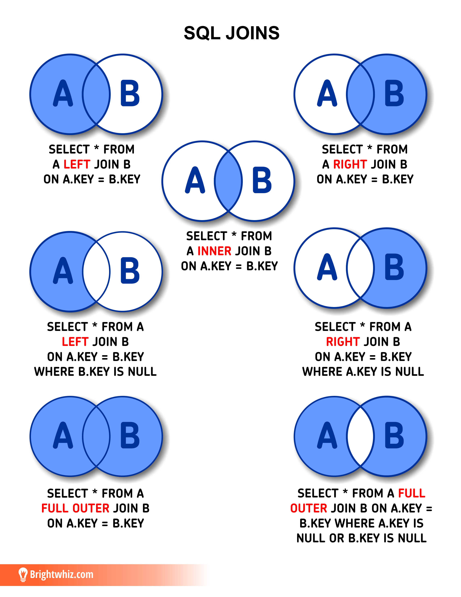

# ¿Qué es SQL?

## Lenguaje de Consulta Estructurado
- SQL (Structured Query Language) es un lenguaje **declarativo** usado para interactuar con bases de datos relacionales.
- Permite **crear**, **modificar**, **consultar** y **eliminar** datos.
- Usaremos **PostgreSQL** como motor de base de datos.

---

# Herramientas que usaremos

## PostgreSQL + Antares SQL
- **PostgreSQL**: potente sistema de base de datos open source.
- **Antares SQL**: cliente gráfico moderno, liviano y multiplataforma para conectarse y consultar PostgreSQL.

---

# ¿Cómo conectarse desde Antares?

### Pasos para conectarse:
1. Abrir Antares SQL.
2. Hacer clic en **New Connection**.
3. Elegir **PostgreSQL**.
4. Completar:
   - **Host**: `localhost` o IP del servidor
   - **Database**: la que se te asignó
   - **Username / Password**: tus credenciales
5. Clic en **Test Connection** → **Connect**

---

# ¿Qué tienes como alumno?

- Usuario exclusivo para ti.
- Base de datos personal para tus ejercicios.
- Cliente gráfico listo para usar.
- Acceso directo a practicar lo aprendido.

---

# Primeros pasos con SQL

## Crear una tabla

```sql
CREATE TABLE "alumno" (
  "id" SERIAL PRIMARY KEY,
  "nombre" TEXT NOT NULL
);
```

---

# Restricciones en tablas

```sql
CREATE TABLE "cursos" (
  "id" SERIAL PRIMARY KEY,
  "nombre" TEXT NOT NULL UNIQUE,
  "duracion" INT CHECK (duracion > 0)
);
```


---

# Restricciones en tablas

```sql
CREATE TABLE "curso" (
  "id" SERIAL PRIMARY KEY,
  "nombre" TEXT NOT NULL,
  "profesor" INTEGER NOT NULL
);

CREATE INDEX "idx_curso__profesor" ON "curso" ("profesor");

ALTER TABLE "curso"
ADD CONSTRAINT "fk_curso__profesor"
FOREIGN KEY ("profesor") REFERENCES "profesor" ("id") ON DELETE CASCADE;
```

---

# Insertar datos

```sql
INSERT INTO "alumno" (nombre) VALUES
('Juan Pérez'),
('María González'),
('Carlos López'),
('Ana Martínez'),
('Luis Rodríguez'),
('Pedro Sánchez'),
('Laura García'),
('José Fernández'),
('Marta Gómez'),
('Javier Díaz');
```

---

# Consultar datos

```sql
SELECT * FROM alumno;
```

```sql
SELECT nombre FROM alumno;
```

---

# Consultar con alias

```sql
SELECT a.nombre AS alumno FROM alumno a;
```

---

# Subconsultas

```sql
SELECT nombre FROM alumno
WHERE id IN (
  SELECT alumno FROM alumno_curso
  WHERE curso = 3
);
```

---

# Filtrar resultados

### Profesor de alumno en Biología

```sql
SELECT nombre
FROM profesor
WHERE id = (
    SELECT profesor
    FROM curso
    WHERE nombre = 'Biología'
    AND id IN (
      SELECT curso
      FROM alumno_curso
      WHERE alumno = (SELECT id FROM alumno WHERE nombre = 'Carlos López')
    )
);
```

---

# Relaciones: INNER JOIN

```sql
SELECT e.nombre, c.nombre AS curso
FROM alumno e
INNER JOIN alumno_curso ac ON e.id = ac.alumno
INNER JOIN curso c ON ac.curso = c.id;
```

---

# Relaciones: LEFT JOIN

```sql
SELECT e.nombre, c.nombre AS curso
FROM alumno e
LEFT JOIN alumno_curso ac ON e.id = ac.alumno
LEFT JOIN curso c ON ac.curso = c.id;
```

---

# Relaciones: FULL JOIN

```sql
SELECT e.nombre, c.nombre AS curso
FROM alumno e
FULL JOIN alumno_curso ac ON e.id = ac.alumno
FULL JOIN curso c ON ac.curso = c.id;
```

---

# JOINs

- `INNER JOIN`: devuelve solo los registros que tienen coincidencias en ambas
tablas.
- `LEFT JOIN`: devuelve todos los registros de la tabla izquierda y los
registros coincidentes de la tabla derecha. Si no hay coincidencia, se rellenan
con NULL.
- `RIGHT JOIN`: devuelve todos los registros de la tabla derecha y los
registros coincidentes de la tabla izquierda. Si no hay coincidencia, se
rellenan con NULL.
- `FULL JOIN`: devuelve todos los registros de ambas tablas, rellenando con
NULL donde no hay coincidencias.
- `SELF JOIN`: se usa para unir una tabla consigo misma.

---

# JOINs



---

# Filtrar con `JOIN`

### Profesor de todos los alumnos en Biología con `JOIN`

```sql
SELECT a.nombre AS alumno, p.nombre AS profesor
FROM alumno a
INNER JOIN alumno_curso ac ON a.id = ac.alumno
INNER JOIN curso c ON ac.curso = c.id
INNER JOIN profesor p ON c.profesor = p.id
WHERE c.nombre = 'Biología';
```

---

# Actualizar datos

```sql
UPDATE alumno
SET nombre = 'Carlos González'
WHERE id = 3;
```

---

# Eliminar registros

```sql
DELETE FROM alumno
WHERE nombre = 'José Fernández';
```

---

# Crear vistas

```sql
CREATE VIEW vista_alumnos_mayores AS
SELECT nombre FROM alumno
WHERE id IN (
  SELECT alumno FROM alumno_curso WHERE curso = 6
);
```

---

# ¿Qué sigue?

## Próximos pasos:
- Funciones avanzadas
- Transacciones y control de errores
- Índices y performance

---

# ¿Todo claro?

### Puedes practicar desde hoy:
- Creando tus propias tablas
- Insertando y consultando datos
- Probando joins entre tablas

---

# Preguntas y Discusión  

¿Tienes dudas? ¡Hablemos!
