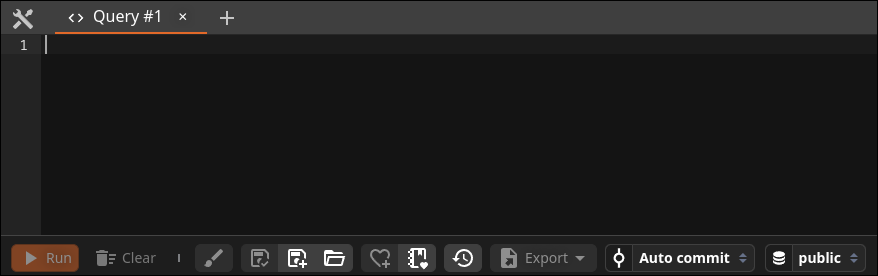
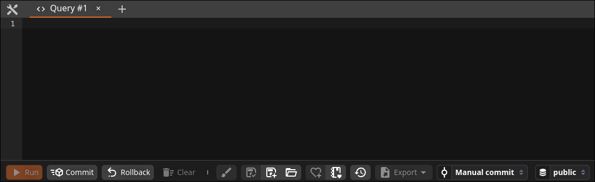
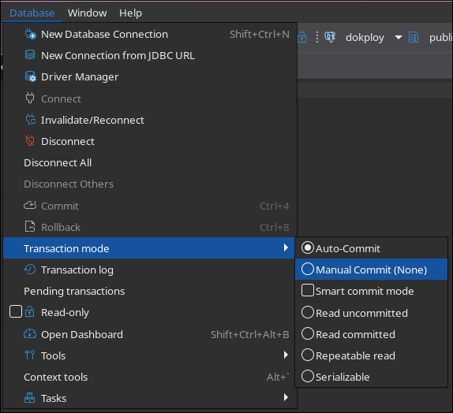
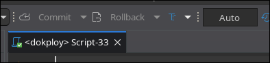
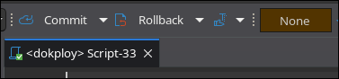

# ¿Qué es una transacción?

## Unidad de trabajo atómica

* Una transacción es un **bloque de operaciones** que se ejecutan como una sola unidad lógica.
* Cumple con las propiedades **ACID**:

  * **Atomicidad**: Todo o nada.
  * **Consistencia**: Mantiene reglas de integridad.
  * **Aislamiento**: Operaciones independientes.
  * **Durabilidad**: Cambios persistentes.

---

# ¿Por qué usar transacciones?

* Para **evitar errores parciales** o inconsistencias si algo falla.
* Para **proteger los datos** cuando múltiples usuarios acceden al sistema.
* Para **controlar concurrencia** y prevenir conflictos.

---

# Transacciones en SQL (PostgreSQL)

## Comandos principales

```sql
BEGIN;
-- operaciones
COMMIT;
```

```sql
BEGIN;
-- operaciones
ROLLBACK;
```

---

# Ejemplo en SQL: transferencia de fondos

```sql
BEGIN;

UPDATE cuenta SET saldo = saldo - 1000 WHERE id = 1;
UPDATE cuenta SET saldo = saldo + 1000 WHERE id = 2;

COMMIT;
```

---

# ¿Qué pasa si hay un error?

```sql
BEGIN;

UPDATE cuenta SET saldo = saldo - 1000 WHERE id = 1;
-- ERROR: cuenta 2 no existe
UPDATE cuenta SET saldo = saldo + 1000 WHERE id = 999;

ROLLBACK;
```

> El `ROLLBACK` revierte todo, como si nada hubiera pasado.

---

# Auto-commit vs commit manual

* La mayoría de los clientes SQL traen **auto-commit activado por defecto**.
* Con auto-commit, **cada sentencia se confirma sola** apenas termina: no hay vuelta atrás.
* Para usar transacciones reales (varias sentencias como una unidad) hay dos opciones:
  1. **Desactivar auto-commit** en el cliente.
  2. Envolver las sentencias en `BEGIN; ... COMMIT;` (o `ROLLBACK;`) explícito.

---

# Antares SQL: auto-commit

* Antares ofrece la opción de auto-commit en la configuración de la conexión /
  consola.
* Con auto-commit on, cada sentencia se confirma sola; con off, las
  operaciones quedan pendientes hasta confirmar.

{ width=70% }

---

# Antares SQL: commit / rollback manual

* Al desactivar el auto-commit aparecen los botones **Commit** y **Rollback**.
* Los cambios sólo son visibles en otras sesiones después de presionar
  **Commit**; **Rollback** descarta todo lo hecho desde el último commit.

{ width=70% }

---

# DBeaver: cómo activar commit manual

* En la barra de herramientas del editor SQL, click derecho sobre el ícono
  de transacción (o menú **Transactions**) → cambiar de **Auto-commit** a
  **Manual commit**.
* También se puede fijar por conexión en **Connection settings →
  Connections → Transactions**.
* Al pasar a manual aparecen los botones **Commit** y **Rollback** en la
  barra inferior del editor.

---

# DBeaver: menú Transaction mode

{ height=80% }

---

# DBeaver: botones deshabilitados en auto-commit

* En modo **Auto-commit**, los botones **Commit** y **Rollback** aparecen
  **deshabilitados** por defecto: no tiene sentido confirmar o revertir
  porque cada sentencia ya se confirma sola al ejecutarse.
* Sólo se habilitan al pasar la conexión a **Manual commit**.

{ width=70% }

---

# DBeaver: botones habilitados en commit manual

* Con **Manual commit** activado, los botones **Commit** y **Rollback** se
  habilitan en la barra del editor.
* Desde aquí se confirma o revierte explícitamente lo ejecutado desde el
  último commit.

{ width=70% }

---

# DBeaver: contador de transacciones

* El recuadro que dice **None** (junto a los botones) lleva el **historial de
  transacciones pendientes** de la sesión.
* Cada vez que corres una sentencia en modo manual, el contador **suma**:
  son operaciones acumuladas que aún no se confirman.
* Al hacer **Commit** o **Rollback**, el contador se resetea a **None**.

---

# Cuidado con el auto-commit

* Auto-commit confirma cada sentencia **siempre que el motor no devuelva
  un error** (sintaxis, constraint, FK inválida, etc.).
* **No protege** contra **errores de regla de negocio**: si la sentencia
  es válida para el motor, queda confirmada.
* Ejemplo: un `UPDATE` que deja una cuenta de banco en saldo negativo es
  SQL perfectamente válido, ej: sin un `CHECK (saldo >= 0)` o una
  transacción manual que valide y haga `ROLLBACK`, queda persistido.
* Conclusión: para flujos con reglas de negocio, **commit manual** o
  validaciones explícitas (CHECK, triggers, lógica en la app).

---

# ¿Cuándo usar cada modo?

* **Auto-commit on**: exploración rápida, consultas de lectura, scripts simples.
* **Auto-commit off / `BEGIN` explícito**: operaciones críticas, varias
  sentencias relacionadas, cuando se quiere poder revertir si algo sale mal.

> Regla práctica: si te equivocas y haces `UPDATE` sin `WHERE` con auto-commit on,
> **no hay rollback que valga**. Con transacción explícita, sí.

---

# Aislamiento de transacciones

## ¿Qué es el aislamiento?

* Determina **cómo interactúan las transacciones concurrentes** entre sí.
* Afecta si una transacción puede **ver cambios realizados por otras** antes de que estas terminen.

---

# Niveles de aislamiento en PostgreSQL

### 1. `READ COMMITTED` (por defecto)

* Cada consulta ve solo datos **confirmados hasta ese momento**.

---

# Aislamiento de transacciones

### 2. `REPEATABLE READ`

* Todas las consultas dentro de una transacción **ven el mismo "snapshot"** de los datos.

---

# Aislamiento de transacciones

### 3. `SERIALIZABLE`

* Simula que las transacciones se ejecutan **una tras otra, en orden**.
* Puede provocar más conflictos y rollbacks por seguridad.

---

# ¿Cómo cambiar el nivel de aislamiento?

```sql
BEGIN;
SET TRANSACTION ISOLATION LEVEL SERIALIZABLE;

-- operaciones...

COMMIT;
```

> Solo usa niveles estrictos si realmente necesitas esa garantía.

---

# Vistas SQL

* Una **vista** es una consulta `SELECT` guardada con un nombre.
* Se consulta **como si fuera una tabla**, pero los datos se calculan
  al vuelo desde las tablas base.
* Útiles para:
  * Encapsular `JOIN`s repetidos en un solo nombre.
  * Simplificar reportes consolidados.
  * Exponer sólo un subconjunto de columnas (ocultar las sensibles).

---

# Crear y usar una vista

```sql
CREATE VIEW alumno_curso_detalle AS
SELECT a.nombre AS alumno,
       c.nombre AS curso,
       p.nombre AS profesor
FROM alumno a
JOIN alumno_curso ac ON ac.alumno_id = a.id
JOIN curso c         ON c.id = ac.curso_id
JOIN profesor p      ON p.id = c.profesor_id;

SELECT * FROM alumno_curso_detalle;
```

* `DROP VIEW alumno_curso_detalle;` para eliminarla.
* `CREATE OR REPLACE VIEW ...` para redefinirla sin borrarla.

---

# Tipos de vista

* **Vista normal (`CREATE VIEW`)**: **no almacena datos**. Cada
  consulta **vuelve a ejecutar el `SELECT`** sobre las tablas base.
  Siempre fresca, paga el costo del query cada vez.
* **Vista materializada (`CREATE MATERIALIZED VIEW`)**: el resultado
  se **persiste físicamente en disco** como una tabla derivada.
  Consultas baratas, pero los datos **quedan congelados** hasta llamar
  a `REFRESH MATERIALIZED VIEW nombre;`.
* Trade-off: **fresca vs barata**.
  * Datos que cambian al segundo → vista normal.
  * Reporte pesado que no necesita estar al instante → materializada.

---

# Mantener una materialized view actualizada

* Hay que decidir **cuándo** ejecutar el `REFRESH`:
  * Manual, cuando se necesite el reporte.
  * En un **cron** (cada hora, cada noche).
  * **Automáticamente** cuando cambien las tablas base.
* El refresh automático ante cambios se resuelve con **triggers** sobre
  las tablas base, que disparan el `REFRESH` cuando hay `INSERT`,
  `UPDATE` o `DELETE`.
<!-- * Triggers se ven en la próxima clase. -->

---

# ¿Qué vimos hoy?

* Concepto de transacción y propiedades ACID.
* Ejemplos en SQL con `BEGIN`, `COMMIT`, `ROLLBACK`.
* Auto-commit vs commit manual en DBeaver y Antares SQL.
* Niveles de aislamiento.
* Vistas SQL: `VIEW` (recalcula) vs `MATERIALIZED VIEW` (persiste).

---

# Preguntas y Discusión  

¿Tienes dudas? ¡Hablemos!
